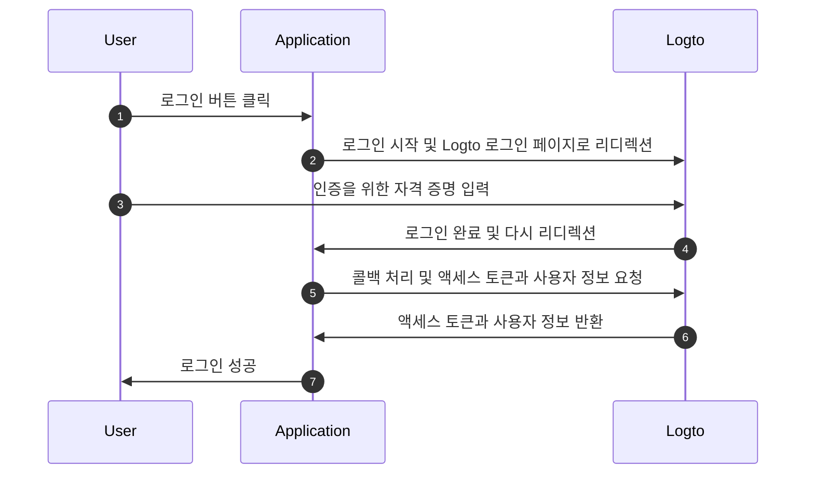
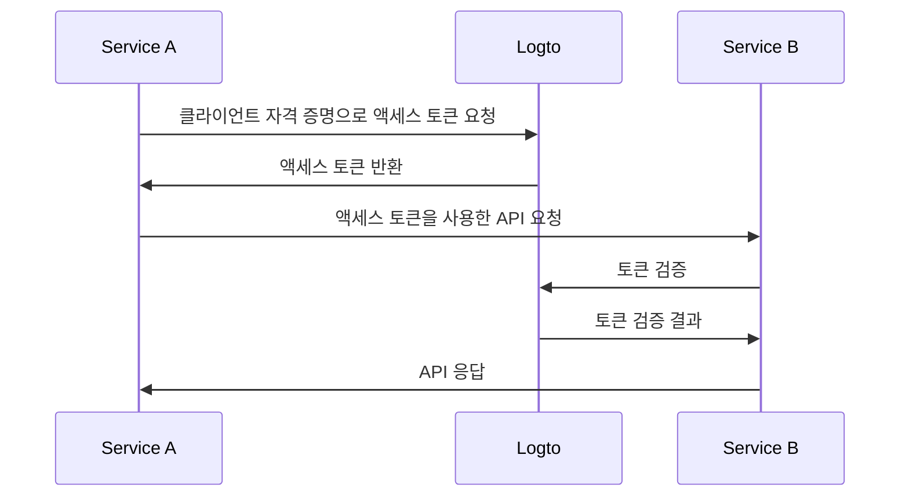

# 인증 (Authentication) 흐름 이해하기

Logto는 [OAuth 2.0](https://auth.wiki/oauth-2.0) 및 [OpenID Connect (OIDC)](https://auth.wiki/openid-connect) 표준을 기반으로 구축되었습니다. 이러한 인증 표준을 이해하면 통합 과정이 더 원활하고 간단해집니다.

### 사용자 인증 흐름 \{#user-authentication-flow}

사용자가 Logto로 로그인할 때 발생하는 일은 다음과 같습니다:

이 흐름에서 통합 과정에 중요한 몇 가지 핵심 개념이 있습니다:

- `Application`: 이는 Logto에서 귀하의 앱을 나타냅니다. 실제 애플리케이션과 Logto 서비스 간의 연결을 설정하기 위해 Logto 콘솔에서 애플리케이션 구성을 생성합니다. [Application](/integrate-logto/application-data-structure/#introduction)에 대해 자세히 알아보세요.
- `Redirect URI`: 사용자가 Logto 로그인 페이지에서 인증을 완료한 후, Logto는 이 URI를 통해 사용자를 다시 애플리케이션으로 리디렉션합니다. 애플리케이션 설정에서 Redirect URI를 구성해야 합니다. 자세한 내용은 [Redirect URIs](/integrate-logto/application-data-structure/#redirect-uris)를 참조하세요.
- `Handle sign-in callback`: Logto가 사용자를 애플리케이션으로 다시 리디렉션할 때, 애플리케이션은 인증 데이터를 처리하고 액세스 토큰과 사용자 정보를 요청해야 합니다. 걱정하지 마세요 - Logto SDK가 이를 자동으로 처리합니다.

이 개요는 빠른 통합을 위한 필수 사항을 다룹니다. 더 깊이 이해하려면 [로그인 경험 설명](/concepts/sign-in-experience/) 가이드를 확인하세요.

### 기계 간 (M2M) 인증 흐름 \{#machine-to-machine-authentication-flow}

Logto는 서비스 간의 직접 인증을 가능하게 하는 [기계 간 (M2M) 애플리케이션](/quick-starts/m2m) 유형을 제공합니다. 이는 [OAuth 2.0 클라이언트 자격 증명 흐름](https://auth.wiki/client-credentials-flow)을 기반으로 합니다:

이 기계 간 (M2M) 인증 흐름은 사용자 상호작용 없이 리소스와 직접 통신해야 하는 애플리케이션 (따라서 UI가 없음)을 위해 설계되었습니다. 예를 들어, Logto에서 사용자 데이터를 업데이트하는 API 서비스나 일일 주문을 가져오는 통계 서비스가 있습니다.

이 흐름에서 서비스는 클라이언트 자격 증명, 즉 [Application ID](/integrate-logto/application-data-structure/#application-id)와 [Application Secret](/integrate-logto/application-data-structure/#application-secret)의 조합을 사용하여 인증합니다. 이러한 자격 증명은 Logto에서 [액세스 토큰](https://auth.wiki/access-token)을 요청할 때 서비스의 아이덴티티로 작용합니다.

## 관련 리소스 \{#related-resources}

<Url href="https://blog.logto.io/secure-cloud-apps-with-oauth-and-openid-connect">
  블로그: OAuth 2.0 및 OpenID Connect로 클라우드 기반 애플리케이션 보안
</Url>

<Url href="https://blog.logto.io/sso-is-better">
  여러 애플리케이션에 대한 싱글 사인온 (SSO)이 더 나은 이유
</Url>

<Url href="https://blog.logto.io/centralized-identity-system">
  다중 애플리케이션 비즈니스를 위한 중앙 집중식 아이덴티티 시스템이 필요한 이유
</Url>
